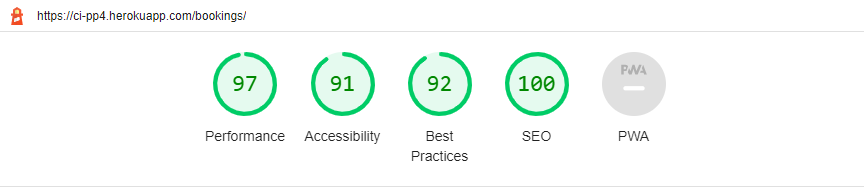
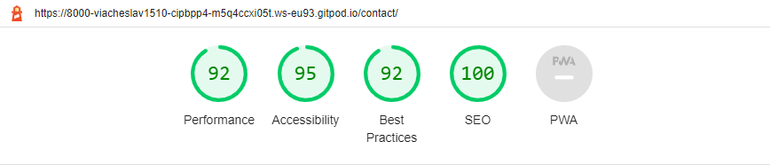
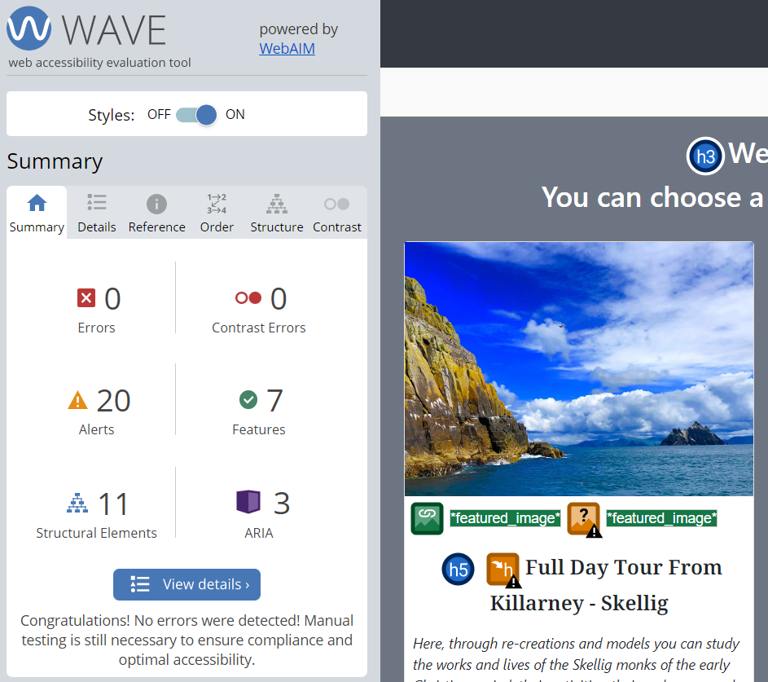
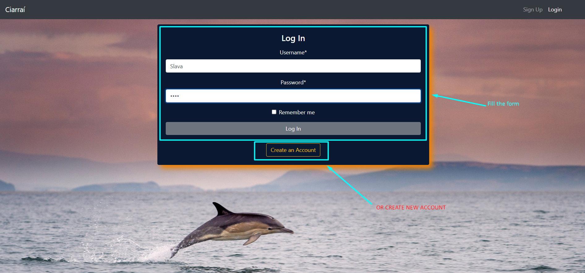
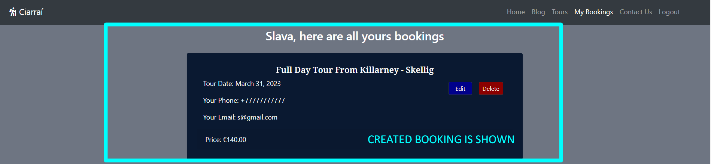
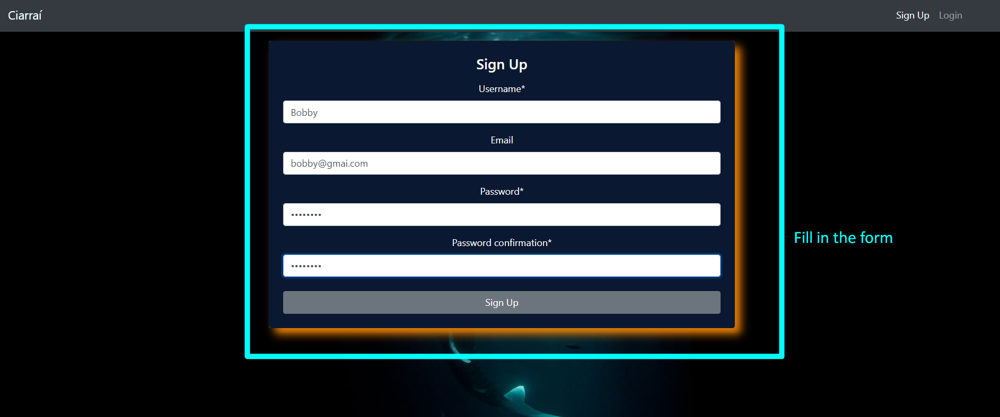
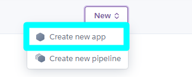
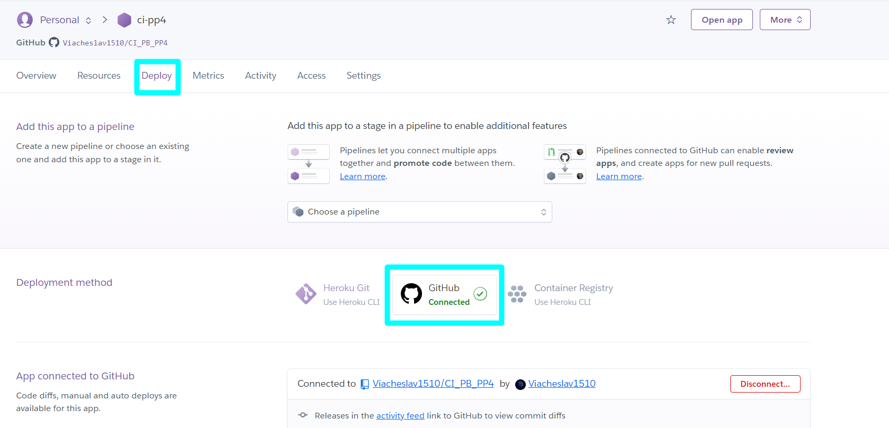

# Kerry Lovers 


**Developer: Slava Kondriianenko**

💻 [Visit live website](https://ci-pp4.herokuapp.com/)


## Table of Contents
    
- [Kerry Lovers ](#kerry-lovers-)
  - [Table of Contents](#table-of-contents)
  - [About](#about)
    - [User Goals](#user-goals)
    - [Site Owner Goals](#site-owner-goals)
  - [User Experience](#user-experience)
    - [Target audience](#target-audience)
    - [User Requirements and Expectations](#user-requirements-and-expectations)
  - [User Stories](#user-stories)
    - [Users](#users)
    - [Site Owner](#site-owner)
    - [Admin / Authorised User](#admin--authorised-user)
    - [Kanban, Epics \& User Stories](#kanban-epics--user-stories)
  - [Design](#design)
    - [Colours](#colours)
    - [Fonts](#fonts)
    - [Structure](#structure)
    - [Wireframes](#wireframes)
  - [Technologies Used](#technologies-used)
    - [Languages \& Frameworks](#languages--frameworks)
    - [Libraries \& Tools](#libraries--tools)
  - [Features](#features)
  - [Validation](#validation)
    - [HTML Validation](#html-validation)
    - [CSS Validation](#css-validation)
    - [PEP8 Validation](#pep8-validation)
    - [Lighthouse](#lighthouse)
    - [Wave](#wave)
  - [Testing](#testing)
    - [Manual testing](#manual-testing)
    - [Automated testing](#automated-testing)
    - [Device Testing \& Browser compatibility](#device-testing--browser-compatibility)
  - [Bugs](#bugs)
  - [Deployment](#deployment)
    - [Fork Repository](#fork-repository)
    - [Clone Repository](#clone-repository)
  - [Credits](#credits)
    - [Images](#images)
    - [Code](#code)
  - [Acknowledgements](#acknowledgements)
    - [Special thanks to the following:](#special-thanks-to-the-following)
    
## About

Kerry Lovers is a website where users can read a blog about Kerry, post their experience, book a trip through Co.Kerry, register, login and logout
<hr>

### User Goals

- Easy navigate between website pages
- To understand what the website is about
- To see blog about County Kerry, Ireland
- To be able to create, edit and delete own posts
- To book a trip, edit and delete booking
- Contact the website owner
- Create an account

### Site Owner Goals

- To provide a solution to allow users to see blog, create post, edit and delete posts
- To provide about us section
- To give testimonials about trips through Co.Kerry
- Let user choose a trip, book a journey, change or delete booking
- Provide way to contact site owner
- Let user register on the website 
- Fully responsive and accessible website
<hr>

## User Experience

### Target audience

- Users that try to find new way for their next trip
- Users that want know more about Co.Kerry in Ireland
- Tourists who visiting Ireland and want to know more about this country
- Users that want to share their trip experience through Co.Kerry
- People that want to book a journey through County Kerry. 

### User Requirements and Expectations

- Easy navigation between website pages
- A welcoming design
- Fully responsive website
- About us section
- Blog
- Booking system
- Contact us page
- Accessibility

Back to [top](#table-of-contents)<hr>

## User Stories

### Users

1. As a first time user I can see a website description so that should help me understand what the site is about (must have)
2. As a user I can navigate across the site so I can move to each feature of the site easily (must have)
3. As a User I can look at header images through the pages so that provide me with a visual (should have)
4. As a User I can look at previous visitors testimonials so that I know what people think about company (should have)
5. As a User I can look at about company section so that help me learn more about organization (should have)
6. As a User I can contact organization so that I can get in touch with a company (must have)
7. As a User I can Create, Update and Delete blogs so that gives me permission to change my posts (must have)
8. As a User I can view blog posts page by page so that I can browse without seeing an overloaded page (must have)
9. As a User I can open post details so I can see detailed post information and leave a comment (must have)
10. As a User I can leave a comment so that allows me to participate in a forum-like discussion (must have)
11. As a User I can be interested in a different blog of similar themes so that gives me opportunity to see similar but new content (could have)
12. As a User I can book a tour so that I can reserve a date for the trip (must have)
13. As a User I can Update or Delete my booking so that I can be flexible with date (must have)
14. As a User I can Sign Up to website so that gives me more permissions (must have)
15. As a user I can login so that I can write a post and book a trip (must have)
16. As a User I can Logout so that can save my data (must have)

### Site Owner

17. As a site owner I can create footer with social links so that user can move to my social media (must have)
18. As a Site owner I can help user navigate through content with search field so that allows me to take control of user site experience (should have)
19. As a Site Owner I can create blog so that provide user regular updates through published posts (must have)
20. As a Site Owner I can provide all devices responsiveness for my users so that they have a good user experience (must have)

### Admin / Authorised User

21. As an Admin / Authorised User I can log in to Site administration so I can access the back end of the site (must have)
22. As an Admin / Authorised User I can add functionality to admin site so I can display, search and filter fields (must have)
23. As an Admin / Authorised User I can create, update and delete posts and comments so that gives me permission to any blog content (must have)
24. As an Admin / Authorised User I can create trip so that gives my user opportunity to book a trip (must have)

### Kanban, Epics & User Stories

- GitHub Kanban was used to track all open user stories
- Epics were created using the milestones feature
- Backlog, In Progress, Done headings were used in the kanban

<details><summary>Kanban</summary>

</details>

<details><summary>Epics</summary>


</details>

<details><summary>User Stories</summary>


</details>

Back to [top](#table-of-contents)<hr>

## Design

### Colours

I chose dark light colours for home page to keep a summertime feeling and inspire user for a trip.
Grey colour was choosen for posts background, tours and bookings
The colors I wanted to stay close to  [colorhunt.co](https://colorhunt.co/palette/feffdeddffbc91c78852734d)

<details><summary>See colour pallet</summary>


</details>

### Fonts

The fonts selected were from Google Fonts, "EB Garamond" was choosen for big headings, "Noto Serif Lao" choosen for smaller text and paragraphs

### Structure

Website pages

The site was designed for the user to be familiar with the layout such as a navigation bar along the top of the pages and a hamburger menu button for smaller screen.

The footer contains all relevant social media links that the business has so the user can visit any social media site and follow the business.

- The site consists of the following pages:
  - Homepage with website description on nature background, about us section and testimonials
  - Blog page with header image background, section for existent posts with pagination for three posts on each page.
  - Post details displays a blog the user has selected so they can read the blog, if they are logged in they can also leave a comment which will then need to be approved before it is displayed. If it's a user's post he can edit and delete this post.
  - Edit post page allows user to change title, excerp, content and post image.
  - Delete post page allows user to delete their post which will delete it from database.
  - Tours page allows registered users to choose a trip and book a date which suits them.
  - My bookings displays all bookings for the user that they have made, user can edit or delete booking.
  - Edit booking allows the user to change their date, email and phone number.
  - Delete booking allows the user to cancel the booking which will then delete it from the database.
  - Contact us allows the user to send site owner a message if they are registered.
  - Login / Logout allows users to login to make create posts, edit, delete their own posts, make bookings, view, edit, and delete bookings.
  - Register allows the user to regiser so they can use the post creation feature and booking system.
  - 404 error page to display if a 404 error is raised.

Database

- Built with Python and the Django framework with a database of a Postgres for the deployed Heroku version(production).
- Five database models was created to show all the content.

<details><summary>See database diagram</summary>

</details>

  - User Model (standard django model) contains the following:
    - user_id
    - password
    - last_login
    - is_superuser
    - username
    - first_name
    - last_name
    - email
    - is_staff
    - is_active
    - date_joined

  - PostModel contains the following:
    - title
    - slug
    - content
    - excerpt
    - author (ForeignKey, User)
    - featured_image
    - date_created

  - Comment Model contains the following:
    - user (ForeignKey, User)
    - post (ForeignKey, PostModel)
    - body
    - date_created
    - approved

  - Tour Model contains the following:
    - tour_name
    - description
    - price
    - max_seats
    - available
    - tour_image


  - Booking Model contains the following:
    - user (ForeignKey, User)
    - tour (ForeignKey, Tour)
    - name
    - email
    - phone
    - tour_date
    - created_date
    - modified_date

  - ContactModel contains the following:
    - user (ForeignKey, User)
    - first_name
    - last_name
    - email
    - message
    - created_date

### Wireframes
The wireframes were created using Balsamiq
<details><summary>Home</summary>

</details>
<details><summary>Blog</summary>

</details>
<details><summary>Post Details</summary>

</details>
<details><summary>Tours</summary>

</details>
<details><summary>My Bookings</summary>

</details>
<details><summary>Sign Up</summary>

</details>
<details><summary>Log In</summary>

</details>

## Technologies Used

### Languages & Frameworks

- HTML
- CSS
- Bootstrap 4.6
- Javascript
- Python
- Django

### Libraries & Tools

- [Am I Responsive](http://ami.responsivedesign.is/)
- [Balsamiq](https://balsamiq.com/)
- [Bootstrap v4.6](https://getbootstrap.com/)
- [Cloudinary](https://cloudinary.com/)
- [Favicon.io](https://favicon.io)
- [Chrome dev tools](https://developers.google.com/web/tools/chrome-devtools/)
- [Font Awesome](https://fontawesome.com/)
- [Git](https://git-scm.com/)
- [GitHub](https://github.com/)
- [Google Fonts](https://fonts.google.com/)
- [Heroku Platform](https://id.heroku.com/login)
- [Postgres](https://www.postgresql.org/)
- [Summernote](https://summernote.org/)
- Validation:
  - [WC3 Validator](https://validator.w3.org/)
  - [Jigsaw W3 Validator](https://jigsaw.w3.org/css-validator/)
  - [PEP8 Python Validator](https://pep8ci.herokuapp.com/)
  - [Lighthouse](https://developers.google.com/web/tools/lighthouse/)
  - [Wave Validator](https://wave.webaim.org/)

Back to [top](#table-of-contents)

## Features 

Home page

- Home page includes nav bar, website description, about us section, testimonials and footer with social links

<details><summary>See feature images</summary>


</details>

<hr>

Navigation

- Active links on all website pages
- On small screens switches to hamburger menu
- Indicates login/logout in status
- Displayed on all pages

<details><summary>See feature images</summary>


</details>

<hr>

Footer
- Contains social media links and copyright
- Media links are blank, so they're open in a new tab to ensure user is not directed away from the website
- Displayed across all pages

<details><summary>See feature images</summary>

</details>

<hr>

Blog page

- Page contains background image and mask with Add Post button
- Contains an existent posts section with pagination for 3 posts per page
- User can click on post title or image to see post details
- Page contains pagination buttons  

<details><summary>See feature images</summary>


</details>

<hr>

Post creation 

- An authorized person can create a post
- creation form provided
- all the fields are required

<details><summary>See feature images</summary>

</details>

<hr>

Post details

- Contains expanded post
- Comments form
- Existent comments section
- If it's user's post he can edit or delete it

<details><summary>See feature images</summary>


</details>

<hr>

Edit post / Delete post

- When user open his own post details edit and delete buttons are shown
- User can edit post with provided edit form
- User should confirm to delete post

<details><summary>See feature images</summary>


</details>

<hr>

Comments 

- Logged in users can leave the comments under post
- Existent comments are shown in comments section

<details><summary>See feature images</summary>

</details>

<hr>

Tours page

- Contains all available tours created by admin
- An authoraized user can choose a tour and book the date for trip

<details><summary>See feature images</summary>

</details>

<hr>

Booking

- User can book a trip with form provided
- Unathorized user should log in or create an account

<details><summary>See feature images</summary>

</details>

<hr>

My Bookings page

- All user's booked trips are shown on page
- user can edit or delete booking

<details><summary>See feature images</summary>

</details>

<hr>

Edit / Delete booking

- User can edit booking with form provided
- To delete the booking user should confirm it

<details><summary>See feature images</summary>


</details>

<hr>

Contact Us page

- An authorized user can send a message to site owner
- When user creates an account with filled in email field, contact us form autofills email field
- Contact form sends message to admin panel

<details><summary>See feature images</summary>

</details>

<hr>

Sign up / Register
- Allow users to register an acoount
- Username and password is required, email is optional
  
<details><summary>See feature images</summary>

</details>

<hr>

Login
- User can login to create a post, edit/delete own posts, book a tour, edit and delete bookings, leave a comment under posts and send message to site owner

<details><summary>See feature images</summary>


</details>

<hr>

Logout

- Allows the user to securely log out
- Ask user if they are sure they want to log out

<details><summary>See feature images</summary>

</details>

Back to [top](#table-of-contents)

## Validation

### HTML Validation 
The W3C Markup Validation Service was used to validate all html files

<details><summary>index.html</summary>

</details>

<details><summary>blog.html</summary>

</details>

<details><summary>add-blog.html</summary>

</details>

<details><summary>blog-details.html</summary>

</details>

<details><summary>edit-blog.html</summary>

</details>

<details><summary>delete-blog.html</summary>

</details>

<details><summary>tours.html</summary>

</details>

<details><summary>book-a-trip.html</summary>

</details>

<details><summary>bookings.html</summary>

</details>

<details><summary>edit-booking.html</summary>

</details>

<details><summary>delete-booking.html</summary>

</details>

<details><summary>contact-us.html</summary>

</details>

<details><summary>message-received.html</summary>

</details>

<details><summary>sign_up.html</summary>

</details>

<details><summary>login.html</summary>

</details>

<details><summary>logout.html</summary>

</details>

### CSS Validation 
The W3C Jigsaw CSS Validation Service was used to validate css file

<details><summary>style.css</summary>

</details>

### PEP8 Validation
[PEP8 Python Validator](https://pep8ci.herokuapp.com/) was used to check the code for PEP8 requirements.

- Accounts app
  - <details><summary>forms.py</summary>
    
    </details>
  - <details><summary>test_views.py</summary>
    
    </details>
  - <details><summary>urls.py</summary>
    
    </details>
  - <details><summary>views.py</summary>
    
    </details>

- Blog app
  - <details><summary>admin.py</summary>
    
    </details>
  - <details><summary>forms.py</summary>
    
    </details>
  - <details><summary>models.py</summary>
    
    </details>
  - <details><summary>test_admin.py</summary>
    
    </details>
  - <details><summary>test_forms.py</summary>
    
    </details>
  - <details><summary>test_models.py</summary>
    
    </details>
  - <details><summary>test_views.py</summary>
    
    </details>
  - <details><summary>urls.py</summary>
    
    </details>
  - <details><summary>views.py</summary>
    
    </details>

- Booking app
  - <details><summary>admin.py</summary>
    
    </details> 
  - <details><summary>forms.py</summary>
    
    </details>     
  - <details><summary>models.py</summary>
    
    </details>     
  - <details><summary>test_models.py</summary>
    
    </details>     
  - <details><summary>test_views.py</summary>
    
    </details>     
  - <details><summary>urls.py</summary>
    
    </details>     
  - <details><summary>views.py</summary>
    
    </details>

- Home app     
  - <details><summary>admin.py</summary>
    
    </details>
  - <details><summary>forms.py</summary>
    
    </details>
  - <details><summary>models.py</summary>
    
    </details>
  - <details><summary>test_models.py</summary>
    
    </details>
  - <details><summary>test_views.py</summary>
    
    </details>
  - <details><summary>urls.py</summary>
    
    </details>
  - <details><summary>views.py</summary>
    
    </details>

### Lighthouse

Performance, best practices and SEO was tested using Lighthouse.

Desktop 

- <details><summary>Home</summary>
    
    </details>  
- <details><summary>Blog</summary>
    
    </details>
- <details><summary>Add Post</summary>
    
    </details>
- <details><summary>Post details</summary>
    
    </details>
- <details><summary>Edit post</summary>
    
    </details>
- <details><summary>Delete post</summary>
    
    </details>
- <details><summary>Tours</summary>
    
    </details>
- <details><summary>Book a trip</summary>
    
    </details>
- <details><summary>My Bookings</summary>
    
    </details>
- <details><summary>Edit booking</summary>
    
    </details>
- <details><summary>Delete booking</summary>
    
    </details>
- <details><summary>Contact Us</summary>
    
    </details>
- <details><summary>Sign Up</summary>
    
    </details>
- <details><summary>Login</summary>
    
    </details>
- <details><summary>Logout</summary>
    
    </details>

Mobile 

- <details><summary>Home</summary>
    
    </details>  
- <details><summary>Blog</summary>
    
    </details>
- <details><summary>Add Post</summary>
    
    </details>
- <details><summary>Post details</summary>
    
    </details>
- <details><summary>Edit post</summary>
    
    </details>
- <details><summary>Delete post</summary>
    
    </details>
- <details><summary>Tours</summary>
    
    </details>
- <details><summary>Book a trip</summary>
    
    </details>
- <details><summary>My Bookings</summary>
    
    </details>
- <details><summary>Edit booking</summary>
    
    </details>
- <details><summary>Delete booking</summary>
    
    </details>
- <details><summary>Contact Us</summary>
    
    </details>
- <details><summary>Sign Up</summary>
    
    </details>
- <details><summary>Login</summary>
    
    </details>
- <details><summary>Logout</summary>
    
    </details>

### Wave

WAVE was used to test the websites accessibility.

- <details><summary>Home</summary>
    
    </details>
- <details><summary>Blog</summary>
    
    </details>
- <details><summary>Tours</summary>
    
    </details>
- <details><summary>Sign Up</summary>
    
    </details>
- <details><summary>Login</summary>
    
    </details>

Back to [top](#table-of-contents)

## Testing

1. Manual testing
2. Automated testing

### Manual testing

1. As a first time user I can see a website description so that should help me understand what the site is about

**Step** | **Expected Result** | **Actual Result**
------------ | ------------ | ------------ |
| Open website | Homepage will load | Works as expected |
| Look at main text  | Description is shown | Works as expected |

<details><summary></summary>

</details>

2. As a user I can navigate across the site so I can move to each feature of the site easily

**Step** | **Expected Result** | **Actual Result**
------------ | ------------ | ------------ |
| Click on any link in the navigation bar | All pages are loaded | Works as expected |

<details><summary></summary>


</details>


3. As a User I can look at header images through the pages so that provide me with a visual

**Step** | **Expected Result** | **Actual Result**
------------ | ------------ | ------------ |
| Open Home page | Header image is shown | Works as expected |
| Open Blog page | Header image is shown | Works as expected |

<details><summary></summary>


</details>


4. As a User I can look at previous visitors testimonials so that I know what people think about company

**Step** | **Expected Result** | **Actual Result**
------------ | ------------ | ------------ |
| Open Home page | Page is loaded | Works as expected |
| Scroll down to testimonials section | Testimonials are shown | Works as expected |

<details><summary></summary>


</details>


5. As a User I can look at about company section so that help me learn more about organization

**Step** | **Expected Result** | **Actual Result**
------------ | ------------ | ------------ |
| Open Home page | Page is loaded | Works as expected |
| Scroll down to about us section | About us section is shown | Works as expected |

<details><summary></summary>


</details>


6. As a User I can contact organization so that I can get in touch with a company

Only logged in users can contact website owner

**Step** | **Expected Result** | **Actual Result**
------------ | ------------ | ------------ |
| On any page click Login link in the navigation | Login page is loaded | Works as expected |
| Fill in the form or create an account | User is logged in | Works as expected |
| Click Contact Us link | Contact Us page is loaded | Works as expected |
| Send message after filled in form | Message about successful process is shown | Works as expected |

<details><summary></summary>




</details>

7. As a User I can Create, Update and Delete blogs so that gives me permission to change my posts
Only logged in users can create, edit and delete posts

**Step** | **Expected Result** | **Actual Result**
------------ | ------------ | ------------ |
| Click Blog link in navigation | Blog page is loaded | Works as expected |
| Click Add Post button to create post | Creation post page is loaded | Works as expected |
| Fill in the post creation form and click post button| Post is show on blog page | Works as expected |
| Click on post title or image to see post details | Post details page is shown | Works as expected |
| Click edit button to edit your own post | Edit post form is shown | Works as expected |
| Chage fields you want to edit your post and click update button | Edited post is shown in post details | Works as expected |
| Click delete button | Delete confirmation is shown | Works as expected |
| Click delete button to confirm | Deleted post is disappeared on the blog page | Works as expected |
| Open someone else's post | User cannot edit or delete a post other than his own | Works as expected |

<details><summary></summary>


</details>

8. As a User I can view blog posts page by page so that I can browse without seeing an overloaded page

**Step** | **Expected Result** | **Actual Result**
------------ | ------------ | ------------ |
| Click Blog link in navigation | Blog page is loaded | Works as expected |
| Click any number of page you want to see | Page is changed | Works as expected |

<details><summary></summary>


</details>

9. As a User I can open post details so I can see detailed post information and leave a comment

**Step** | **Expected Result** | **Actual Result**
------------ | ------------ | ------------ |
| Click Post title or image | Post details is loaded | Works as expected |
| Scroll down to comments section | Comments section is shown | Works as expected |

<details><summary></summary>


</details>

10. As a User I can leave a comment so that allows me to participate in a forum-like discussion

**Step** | **Expected Result** | **Actual Result**
------------ | ------------ | ------------ |
| Leave a message in comments form and click comment button | Post details is loaded | Works as expected |
| Scroll down to comments section | Message left successful is shown | Works as expected |
| Admin has to approve comment to show leaved message | Comments section is shown | Works as expected |
| After admin approve the comment click Comments button | Comments are shown | Works as expected |

<details><summary></summary>


</details>

11. As a User I can be interested in a different blog of similar themes so that gives me opportunity to see similar but new content

Haven't provided. Left for further development

12. As a User I can book a tour so that I can reserve a date for the trip

Tours are created by Admin, user can only choose a trip that suits.

<details><summary>See tour creation images</summary>


</details>

Only authorized user can book a trip

<details><summary>See unthoraized user images</summary>


</details>


**Step** | **Expected Result** | **Actual Result**
------------ | ------------ | ------------ |
| Open tours page by click tours link in navigation | Tours page is loaded | Works as expected |
| Choose any tour you want to book and click Book Now button | Booking form is shown | Works as expected |
| Fill in the form and click Book button | My bookings are shown | Works as expected |

<details><summary></summary>



</details>

13. As a User I can Update or Delete my booking so that I can be flexible with date

**Step** | **Expected Result** | **Actual Result**
------------ | ------------ | ------------ |
| Open my bookings page by click link in navigation | My bookings page is loaded | Works as expected |
| Click edit button to edit booking | Edit booking form is shown | Works as expected |
| Change a field you want in the form and click Update button | Changed booking is shown | Works as expected |
| Click delete button | Delete confirmation is shown | Works as expected |
| Click delete button to confirm | Message that booking is deleted is shown | Works as expected |

<details><summary></summary>


</details>

14. As a User I can Sign Up to website so that gives me more permissions

**Step** | **Expected Result** | **Actual Result**
------------ | ------------ | ------------ |
| Click Sign Up link in navigation | Sign up page is loaded | Works as expected |
| Fill in sign up form | Edit booking form is shown | Works as expected |

<details><summary></summary>



</details>

If user tries to create existent username, form show message 
<details><summary>User already exists</summary>

</details>

15. As a user I can login so that I can write a post and book a trip

**Step** | **Expected Result** | **Actual Result**
------------ | ------------ | ------------ |
| Click Log in link in navigation | Log in page is loaded | Works as expected |
| Fill in log in form | Log in form show message if fields are not valid | Works as expected |
| User can click remember me button to remember their information | Program memorize user information | Works as expected |
| Click Log In button | User is logged in and message is shown | Works as expected |

<details><summary></summary>


</details>

16. As a User I can Logout so that can save my data

**Step** | **Expected Result** | **Actual Result**
------------ | ------------ | ------------ |
| Click Logout link in navigation | Log out confirmation page is loaded | Works as expected |
| Click logout to confirm | User logged out and message is shown | Works as expected |

<details><summary></summary>


</details>

17. As a site owner I can create footer with social links so that user can move to my social media

**Step** | **Expected Result** | **Actual Result**
------------ | ------------ | ------------ |
| Open any page and scroll down at bottom of page | See footer | Works as expected |
| Click on any footer link | Page opened in separate window | Works as expected |

<details><summary></summary>


</details>

18. As a Site owner I can help user navigate through content with search field so that allows me to take control of user site experience 

Haven't provided. Left for further development

19. As a Site Owner I can create blog so that provide user regular updates through published posts

**Step** | **Expected Result** | **Actual Result**
------------ | ------------ | ------------ |
| Open blog page | Blog exists | Works as expected |

20. As a Site Owner I can provide all devices responsiveness for my users so that they have a good user experience

**Step** | **Expected Result** | **Actual Result**
------------ | ------------ | ------------ |
| Open any page on small screen | All content is responsive | Works as expected |

<details><summary></summary>


</details>

21. As an Admin / Authorised User I can log in to Site administration so I can access the back end of the site

**Step** | **Expected Result** | **Actual Result**
------------ | ------------ | ------------ |
| Open admin page | Log in form is shown | Works as expected |
| Fill in form with Admin information | Admin is logged in | Works as expected |

<details><summary></summary>


</details>

22. As an Admin / Authorised User I can add functionality to admin site so I can display, search and filter fields

**Step** | **Expected Result** | **Actual Result**
------------ | ------------ | ------------ |
| Open any model on admin page | Feilds, search bar and filter are shown | Works as expected |
| Filter or search content you want | Search and filter work | Works as expected |

<details><summary></summary>


</details>

23. As an Admin / Authorised User I can create, update and delete posts and comments so that gives me permission to any blog content 

**Step** | **Expected Result** | **Actual Result**
------------ | ------------ | ------------ |
| Open any model on admin page | Feilds, search bar and filter are shown | Works as expected |
| Filter or search content you want | Search and filter work | Works as expected |

<details><summary></summary>


</details>

24. As an Admin / Authorised User I can create trip so that gives my user opportunity to book a trip 

**Step** | **Expected Result** | **Actual Result**
------------ | ------------ | ------------ |
| Open tours in admin panel  | Add tour button is shown | Works as expected |
| Click add tour button and fill in all fields | Fields are shown | Works as expected |
| Save the tour | New tour is shown in admin panel and on the website | Works as expected |

<details><summary></summary>


</details>

Back to [top](#table-of-contents)

### Automated testing

Testing was done using the built in Django module, unittest.
Coverage was also usesd to generate a report

Accounts app

- <details><summary>test_views.py</summary>
  
  </details>
- <details><summary>Coverage Accounts</summary>
  
  </details>

Blog app 

- <details><summary>test_admin.py</summary>
  
  </details>
- <details><summary>test_forms.py</summary>
  
  </details>
- <details><summary>test_models.py</summary>
  
  </details>
- <details><summary>test_views.py</summary>
  
  </details>
- <details><summary>Coverage Blog</summary>
  
  </details>

Booking app

- <details><summary>test_models.py</summary>
  
  </details>
- <details><summary>test_views.py</summary>
  
  </details>
- <details><summary>Coverage Booking</summary>
  
  </details>

Home app

- <details><summary>test_models.py</summary>
  
  </details>
- <details><summary>test_views.py</summary>
  
  </details>
- <details><summary>Coverage Home</summary>
  
  </details>

Back to [top](#table-of-contents)

### Device Testing & Browser compatibility

The site uses to test on various real world devices was [BrowserStack](https://ci-pp4-the-diplomat.herokuapp.com/)  

This allowed me to test on real devices and not just device emulators.

The following devices were used to test my site:

<details><summary>Samsung Galaxy S22 Ultra</summary>

</details>

<details><summary>Apple iPhone 13</summary>

</details>

<details><summary>Huawei</summary>

</details>

<details><summary>Mozilla Firefox (v111 latest)</summary>

</details>

<details><summary>Google Chrome (v111 latest)</summary>

</details>

<details><summary>Edge (v111 latest)</summary>

</details>

Back to [top](#table-of-contents)

## Bugs

| **Bug** | **Fix** |
| ------- | ------- |
| Unauthorized user can create a post | Add login required decorator to create_post view |
| Post details can not be shown(bad request) | Add slugify function to post model to create automatically the slug |
| Blog pagination doesn't work | Send page_object variable instead of posts objects in blog_home view |
| Home link is active on all pages | Add statement to request full path to home view |
| User can book a trip on date even when seats are full  | In booking view filter booking objects by date and compare it to max_seats |
| Booking form accepting phone number that are too short | Use Regex validator to valid phone number input |
| User can make a booking on date in the past | Add widget DateInput to booking form and set minimum valid date |
| Message doesn't shown after user login | Add messages to login view |
| 'Invalid or missing CSRF token' message while render booking page | Add csrf_token to edit-booking.html form |

## Deployment

Installing Django and supporting libraries

- Terminal:
1. Install Django and gunicorn ```pip3 install 'django<4' gunicorn```
2. Install library for PostgeSQL```pip3 install dj_database_url psycopg2```
3. Install Cloudinary Libraries ```pip3 install dj3-cloudinary-storage```
4. Create requirements file ```pip3 freeze --local > requirements.txt```
5. Create Project ```django-admin startproject pp4-ci```
6. Create App (blog) ```python3 manage.py startapp blog```

- settings.py:
```
  INSTALLED_APPS = [
    …
    'blog',
]
```

- Terminal: 
1. Migrate Changes ```python3 manage.py migrate``` 

<hr>

Deploying an app to Heroku(empty app)

- Create a new app on heroku

  1. Log in to Heroku and go to the Dashboard.
  2. Click "New"  <details><summary>Details</summary>
                  
                  </details>

  3. Click "Create New App" <details><summary>Details</summary>
                            
                            </details>
  4. Give your app name and select Region <details><summary>Details</summary>
                            
                            </details>                             

- Create a database

  1. Log in to ElephantSQL.com to access your dashboard
  2. Click "Create New Instance"
  3. Set up your plan
  4. Select "Select Region"
  5. Select a data center near you
  6. Then click "Review"
  7. Check your details are correct and then click "Create instance"

- Create an env.py file

  1. In your project workspace, create a file called env.py.
  2. Add env.py file to .gitignore file
  3. In your env.py file add the following line of code: 
  ```
  import os
  ```
  4. Set next environment variables:
  - Return to the ElephantSQL dashboard and click on the database instance name for this project
  - In the URL section, click the copy icon to copy the database URL
  ```
  os.environ["DATABASE_URL"]="<DATABASE_URL>"
  ```
  - Add a SECRET_KEY 
  ```
  os.environ["SECRET_KEY"]="my_super^secret@key"
  ```
  5. Save the file
   
- Modify settings.py 
  
  1. Open up your settings.py file and add the following code below your Path import
  ```
    import os
    import dj_database_url
    if os.path.isfile('env.py'):
      import env
  ```
  2. Remove the insecure secret key provided by Django and change your SECRET_KEY variable to the following
  ```
   SECRET_KEY = os.environ.get('SECRET_KEY')
  ```
  3. Comment out the original DATABASES variable and add the code below, as shown
  ```
    # DATABASES = {
    #     'default': {
    #         'ENGINE': 'django.db.backends.sqlite3',
    #         'NAME': BASE_DIR / 'db.sqlite3',
    #     }
    # }
        
    DATABASES = {
        'default': dj_database_url.parse(os.environ.get("DATABASE_URL"))
    }
  ```
  4. Save settings.py
  5. Run the migration command in your terminal to migrate your database structure to the newly-connected ElephantSQL database
  ```
  python manage.py migrate
  ```
  6. Add, commit and push your project to GitHub.

- Add Heroku Config Vars
  
  1. Go back to the Heroku dashboard and open the Settings tab
  2. Add three config vars:
    - ```DATABASE_URL: DATABASE_URL```
    - ```SECRET_KEY: YOUR_SECRET_KEY```
    - ```PORT: 8000```

- Get static and media files stored on Cloudinary

  1. Set Up Cloudinary
    - Create Cloudinary account [cloudinary.com](https://cloudinary.com/)
    - Verify your email and you will be brought to the dashboard
    - Go to dashboard and copy "API Enviroment variable"
  2. Go to env.py and add another line:
   ```
    os.environ["CLOUDINARY_URL"] = "cloudinary://URL"
   ```
  3. Go to Heroku Dashboard settings and add to Config Vars new line:
    - ```CLOUDINARY_URL: cloudinary://URL```
    - ```Disable_COLLECTSTATIC: 1```
  4. Go to settings.py:
  - add cloudinary app:
    ```
    INSTALLED_APPS = [
        …
        'cloudinary',
        'blog',
    ]
    ```
  - add next lines to static files section:
   ```
   STATIC_URL = '/static/'
   STATICFILES_STORAGE = 'cloudinary_storage.storage.StaticHashedCloudinaryStorage'
   STATICFILES_DIRS = [os.path.join(BASE_DIR, 'static')]
   STATIC_ROOT = os.path.join(BASE_DIR, 'staticfiles')

   MEDIA_URL = '/media/'
   DEFAULT_FILE_STORAGE = 'cloudinary_storage.storage.MediaCloudinaryStorage'
   MEDIA_ROOT = os.path.join(BASE_DIR, 'images')
   ```
  - create templates directory:
   ```
    BASE_DIR = Path(__file__).resolve().parent.parent
    TEMPALTES_DIR = os.path.join(BASE_DIR, 'templates')

    ...
    TEMPLATES = [
    {
        'BACKEND': 'django.template.backends.django.DjangoTemplates',
        'DIRS': [TEMPALTES_DIR],
        'APP_DIRS': True,
        'OPTIONS': {
            'context_processors': [
                'django.template.context_processors.debug',
                'django.template.context_processors.request',
                'django.contrib.auth.context_processors.auth',
                'django.contrib.messages.context_processors.messages',
            ],
        },
    },
    ]
   ```
  - add allowed host:

  ```
  ALLOWED_HOSTS = ['<heroku-app-name>.herokuapp.com', 'localhost']
  ```
  5. Create media, static and templates folders on the top level

- Create ```Procfile``` on the top level:
  1. Type next line inside Procfyle:
      ```
      web: gunicorn <project_name>.wsgi
      ``` 
  2. add, commit and push

- Deploy on Heroku

  1. Go to Heroku Dashboard Deploy section
  2. Choose deploy method GitHub
  3. Search for deploy repository
  4. Click Connect
  5. Click Deploy Branch
    
    <details><summary>Details</summary>
    
    
    </details>

Final Deployment(after created project)

  1. Go to settings.py and change:
   ```
    DEBUG = FALSE

    X_FRAME_OPTIONS = 'SAMORIGIN' # for Summernote
   ```
  2. Update requirements file by Terminal command: ```pip3 freeze --local > requirements.txt```
  3. Add, commit and push project
  4. Go to Heroku Dashboard settings and delete ```DISABLE_COLLECTSTATIC``` config var
  5. Go to Heroku Dashboard deploy section and scroll down to Deploy Branch button and click it.

<hr>

### Fork Repository
To fork the repository by following these steps:
1. Go to the GitHub repository
2. Click on Fork button in upper right hand corner
<hr>

### Clone Repository
You can clone the repository by following these steps:
1. Go to the GitHub repository 
2. Locate the Code button above the list of files and click it 
3. Select if you prefere to clone using HTTPS, SSH, or Github CLI and click the copy button to copy the URL to your clipboard
4. Open Git Bash
5. Change the current working directory to the one where you want the cloned directory
6. Type git clone and paste the URL from the clipboard ($ git clone https://github.com/YOUR-USERNAME/YOUR-REPOSITORY)
7. Press Enter to create your local clone.

Back to [top](#table-of-contents)

## Credits

### Images

Images used were sourced from Pexels.com and an AI image generator (Dalle2) was used for an image with the permission from OpenAI

### Code

Bootstrap dark navigation theme was used alongside boostrap classes and carousel

## Acknowledgements

### Special thanks to the following:
- Code Institute
- My Mentor Mo Shami