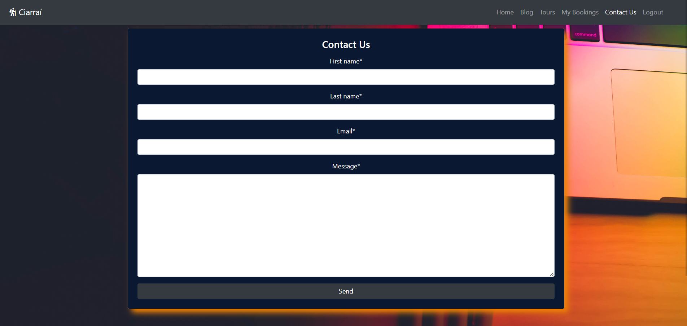
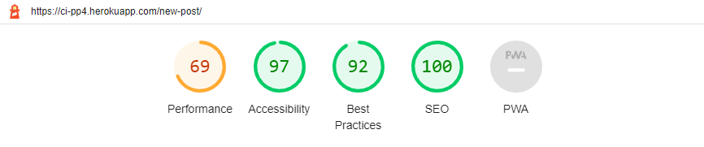
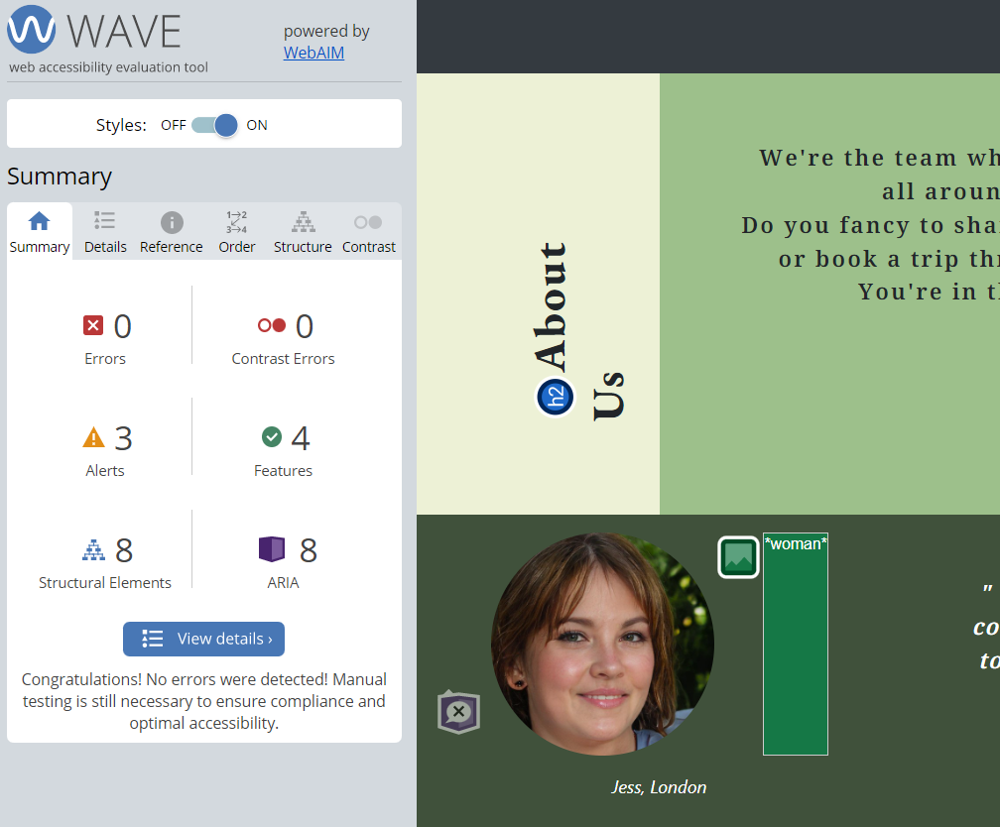

# Kerry Lovers 

**Developer: Slava Kondriianenko**

💻 [Visit live website](https://ci-pp4.herokuapp.com/)

## Table of Contents
    
- [Kerry Lovers ](#kerry-lovers-)
  - [Table of Contents](#table-of-contents)
  - [About](#about)
    - [User Goals](#user-goals)
    - [Site Owner Goals](#site-owner-goals)
  - [User Experience](#user-experience)
    - [Target audience](#target-audience)
    - [User Requirements and Expectations](#user-requirements-and-expectations)
  - [User Stories](#user-stories)
    - [Users](#users)
    - [Site Owner](#site-owner)
    - [Admin / Authorised User](#admin--authorised-user)
    - [Kanban, Epics \& User Stories](#kanban-epics--user-stories)
  - [Design](#design)
    - [Colours](#colours)
    - [Fonts](#fonts)
    - [Structure](#structure)
    - [Wireframes](#wireframes)
  - [Technologies Used](#technologies-used)
    - [Languages \& Frameworks](#languages--frameworks)
    - [Libraries \& Tools](#libraries--tools)
  - [Features](#features)
  - [Validation](#validation)
    - [HTML Validation](#html-validation)
    - [CSS Validation](#css-validation)
    - [PEP8 Validation](#pep8-validation)
    - [Lighthouse](#lighthouse)
    - [Wave](#wave)
        - [Back to top](#back-to-top)
  - [Testing](#testing)
    
## About

Kerry Lovers is a website where users can read a blog about Kerry, post their experience, book a trip through Co.Kerry, register, login and logout

### User Goals

- Easy navigate between website pages
- To understand what the website is about
- To see blog about County Kerry, Ireland
- To be able to create, edit and delete own posts
- To book a trip, edit and delete booking
- Contact the website owner
- Create an account

### Site Owner Goals

- To provide a solution to allow users to see blog, create post, edit and delete posts
- To provide about us section
- To give testimonials about trips through Co.Kerry
- Let user choose a trip, book a journey, change or delete booking
- Provide way to contact site owner
- Let user register on the website 
- Fully responsive and accessible website

## User Experience

### Target audience

- Users that try to find new way for their next trip
- Users that want know more about Co.Kerry in Ireland
- Tourists who visiting Ireland and want to know more about this country
- Users that want to share their trip experience through Co.Kerry
- People that want to book a journey through County Kerry. 

### User Requirements and Expectations

- Easy navigation between website pages
- A welcoming design
- Fully responsive website
- About us section
- Blog
- Booking system
- Contact us page
- Accessibility

Back to [top](#table-of-contents)

## User Stories

### Users

1. As a first time user I can see a website description so that should help me understand what the site is about (must have)
2. As a user I can navigate across the site so I can move to each feature of the site easily (must have)
3. As a User I can look at header images through the pages so that provide me with a visual (should have)
4. As a User I can look at previous visitors testimonials so that I know what people think about company (should have)
5. As a User I can look at about company section so that help me learn more about organization (should have)
6. As a User I can contact organization so that I can get in touch with a company (must have)
7. As a User I can Create, Update and Delete blogs so that gives me permission to change my posts (must have)
8. As a User I can view blog posts page by page so that I can browse without seeing an overloaded page
9. As a User I can open post details so I can see detailed post information and leave a comment (must have)
10. As a User I can leave a comment so that allows me to participate in a forum-like discussion
11. As a User I can be interested in a different blog of similar themes so that gives me opportunity to see similar but new content (could have)
12. As a User I can book a tour so that I can reserve a date for the trip (must have)
13. As a User I can Update or Delete my booking so that I can be flexible with date (must have)
14. As a User I can Sign Up to website so that gives me more permissions (must have)
15. As a user I can login so that I can write a post and book a trip
16. As a User I can Logout so that can save my data (must have)

### Site Owner

17. As a site owner I can create footer with social links so that user can move to my social media (must have)
18. As a Site owner I can help user navigate through content with search field so that allows me to take control of user site experience (should have)
19. As a Site Owner I can create blog so that provide user regular updates through published posts (must have)
20. As a Site Owner I can provide all devices responsiveness for my users so that they have a good user experience (must have)

### Admin / Authorised User

21. As an Admin / Authorised User I can log in to Site administration so I can access the back end of the site (must have)
22. As an Admin / Authorised User I can add functionality to admin site so I can display, search and filter fields (must have)
23. As an Admin / Authorised User I can create, update and delete posts and comments so that gives me permission to any blog content (must have)
24. As an Admin / Authorised User I can create trip so that gives my user opportunity to book a trip (must have)
25. As an Admin / Authorised User I can search and filter any created content so that I can find the information I am looking for (must have)

### Kanban, Epics & User Stories

- GitHub Kanban was used to track all open user stories
- Epics were created using the milestones feature
- Backlog, In Progress, Done headings were used in the kanban

Kanban

Epics

User Stories

Back to [top](#table-of-contents)

## Design

### Colours

I chose dark light colours for home page to keep a summertime feeling and inspire user for a trip.
Grey colour was choosen for posts background, tours and bookings
The colors I wanted to stay close to  [colorhunt.co](https://colorhunt.co/palette/feffdeddffbc91c78852734d)

See colour pallet

### Fonts

The fonts selected were from Google Fonts, "EB Garamond" was choosen for big headings, "Noto Serif Lao" choosen for smaller text and paragraphs

### Structure

Website pages

The site was designed for the user to be familiar with the layout such as a navigation bar along the top of the pages and a hamburger menu button for smaller screen.

The footer contains all relevant social media links that the business has so the user can visit any social media site and follow the business.

- The site consists of the following pages:
  - Homepage with website description on nature background, about us section and testimonials
  - Blog page with header image background, section for existent posts with pagination for three posts on each page.
  - Post details displays a blog the user has selected so they can read the blog, if they are logged in they can also leave a comment which will then need to be approved before it is displayed. If it's a user's post he can edit and delete this post.
  - Edit post page allows user to change title, excerp, content and post image.
  - Delete post page allows user to delete their post which will delete it from database.
  - Tours page allows registered users to choose a trip and book a date which suits them.
  - My bookings displays all bookings for the user that they have made, user can edit or delete booking.
  - Edit booking allows the user to change their date, email and phone number.
  - Delete booking allows the user to cancel the booking which will then delete it from the database.
  - Contact us allows the user to send site owner a message if they are registered.
  - Login / Logout allows users to login to make create posts, edit, delete their own posts, make bookings, view, edit, and delete bookings.
  - Register allows the user to regiser so they can use the post creation feature and booking system.
  - 404 error page to display if a 404 error is raised.

Database

- Built with Python and the Django framework with a database of a Postgres for the deployed Heroku version(production).
- Five database models was created to show all the content.

See database diagram

  - User Model (standard django model) contains the following:
    - user_id
    - password
    - last_login
    - is_superuser
    - username
    - first_name
    - last_name
    - email
    - is_staff
    - is_active
    - date_joined

  - PostModel contains the following:
    - title
    - slug
    - content
    - excerpt
    - author (ForeignKey, User)
    - featured_image
    - date_created

  - Comment Model contains the following:
    - user (ForeignKey, User)
    - post (ForeignKey, PostModel)
    - body
    - date_created
    - approved

  - Tour Model contains the following:
    - tour_name
    - description
    - price
    - max_seats
    - available
    - tour_image

  - Booking Model contains the following:
    - user (ForeignKey, User)
    - tour (ForeignKey, Tour)
    - name
    - email
    - phone
    - tour_date
    - created_date
    - modified_date

  - ContactModel contains the following:
    - user (ForeignKey, User)
    - first_name
    - last_name
    - email
    - message
    - created_date

### Wireframes
The wireframes were created using Balsamiq

## Technologies Used

### Languages & Frameworks

- HTML
- CSS
- Javascript
- Python
- Django

### Libraries & Tools

- [Am I Responsive](http://ami.responsivedesign.is/)
- [Balsamiq](https://balsamiq.com/)
- [Bootstrap v4.6](https://getbootstrap.com/)
- [Cloudinary](https://cloudinary.com/)
- [Favicon.io](https://favicon.io)
- [Chrome dev tools](https://developers.google.com/web/tools/chrome-devtools/)
- [Font Awesome](https://fontawesome.com/)
- [Git](https://git-scm.com/)
- [GitHub](https://github.com/)
- [Google Fonts](https://fonts.google.com/)
- [Heroku Platform](https://id.heroku.com/login)
- [Postgres](https://www.postgresql.org/)
- [Summernote](https://summernote.org/)
- Validation:
  - [WC3 Validator](https://validator.w3.org/)
  - [Jigsaw W3 Validator](https://jigsaw.w3.org/css-validator/)
  - [JShint](https://jshint.com/)
  - [Pycodestyle(PEP8)](https://pypi.org/project/pycodestyle/)
  - [Lighthouse](https://developers.google.com/web/tools/lighthouse/)
  - [Wave Validator](https://wave.webaim.org/)

Back to [top](#table-of-contents)

## Features 

Home page

- Home page includes nav bar, website description, about us section, testimonials and footer with social links

See feature images

Navigation

- Active links on all website pages
- On small screens switches to hamburger menu
- Indicates login/logout in status
- Displayed on all pages

See feature images

Footer
- Contains social media links and copyright
- Media links are blank, so they're open in a new tab to ensure user is not directed away from the website
- Displayed across all pages

See feature images

Blog page

- Page contains background image and mask with Add Post button
- Contains an existent posts section with pagination for 3 posts per page
- User can click on post title or image to see post details
- Page contains pagination buttons  

See feature images

Post creation 

- An authorized person can create a post
- creation form provided
- all the fields are required

See feature images

Post details

- Contains expanded post
- Comments form
- Existent comments section
- If it's user's post he can edit or delete it

See feature images

Edit post / Delete post

- When user open his own post details edit and delete buttons are shown
- User can edit post with provided edit form
- User should confirm to delete post

See feature images

Comments 

- Logged in users can leave the comments under post
- Existent comments are shown in comments section

See feature images

Tours page

- Contains all available tours created by admin
- An authoraized user can choose a tour and book the date for trip

See feature images

Booking

- User can book a trip with form provided
- Unathorized user should log in or create an account

See feature images

My Bookings page

- All user's booked trips are shown on page
- user can edit or delete booking

See feature images

Edit / Delete booking

- User can edit booking with form provided
- To delete the booking user should confirm it

See feature images

Contact Us page

- An authorized user can send a message to site owner
- When user creates an account with filled in email field, contact us form autofills email field
- Contact form sends message to admin panel

See feature images

Sign up / Register
- Allow users to register an acoount
- Username and password is required, email is optional
  

See feature images

Login
- User can login to create a post, edit/delete own posts, book a tour, edit and delete bookings, leave a comment under posts and send message to site owner

See feature images

Logout

- Allows the user to securely log out
- Ask user if they are sure they want to log out

See feature images

Back to [top](#table-of-contents)

## Validation

### HTML Validation 
The W3C Markup Validation Service was used to validate all html files

index.html

blog.html

add-blog.html

blog-details.html

edit-blog.html

delete-blog.html

tours.html

book-a-trip.html

bookings.html

edit-booking.html

delete-booking.html

contact-us.html

message-received.html

sign_up.html

login.html

logout.html

### CSS Validation 
The W3C Jigsaw CSS Validation Service was used to validate css file

style.css

### PEP8 Validation
[PEP8 Python Validator](https://pep8ci.herokuapp.com/) was used to check the code for PEP8 requirements.

- Accounts app
  - 

forms.py

    
    

  - 

test_views.py

    
    

  - 

urls.py

    
    

  - 

views.py

    
    

- Blog app
  - 

admin.py

    
    

  - 

forms.py

    
    

  - 

models.py

    
    

  - 

test_admin.py

    
    

  - 

test_forms.py

    
    

  - 

test_models.py

    
    

  - 

test_views.py

    
    

  - 

urls.py

    
    

  - 

views.py

    
    

- Booking app
  - 

admin.py

    
    
 
  - 

forms.py

    
    
     
  - 

models.py

    
    
     
  - 

test_models.py

    
    
     
  - 

test_views.py

    
    
     
  - 

urls.py

    
    
     
  - 

views.py

    
    

- Home app     
  - 

admin.py

    
    

  - 

forms.py

    
    

  - 

models.py

    
    

  - 

test_models.py

    
    

  - 

test_views.py

    
    

  - 

urls.py

    
    

  - 

views.py

    
    

### Lighthouse

Performance, best practices and SEO was tested using Lighthouse.

Desktop 

- 

Home

    
    
  
- 

Blog

    
    

- 

Add Post

    
    

- 

Post details

    
    

- 

Edit post

    
    

- 

Delete post

    
    

- 

Tours

    
    

- 

Book a trip

    
    

- 

My Bookings

    
    

- 

Edit booking

    
    

- 

Delete booking

    
    

- 

Contact Us

    
    

- 

Sign Up

    
    

- 

Login

    
    

- 

Logout

    
    

Mobile 

- 

Home

    
    
  
- 

Blog

    
    

- 

Add Post

    
    

- 

Post details

    
    

- 

Edit post

    
    

- 

Delete post

    
    

- 

Tours

    
    

- 

Book a trip

    
    

- 

My Bookings

    
    

- 

Edit booking

    
    

- 

Delete booking

    
    

- 

Contact Us

    
    

- 

Sign Up

    
    

- 

Login

    
    

- 

Logout

    
    

### Wave

WAVE was used to test the websites accessibility.

- 

Home

    
    

- 

Blog

    
    

- 

Tours

    
    

- 

Sign Up

    
    

- 

Login

    
    

##### Back to [top](#table-of-contents)

## Testing

1. Manual testing
2. Automated testing